# JitterJuice · v1.1

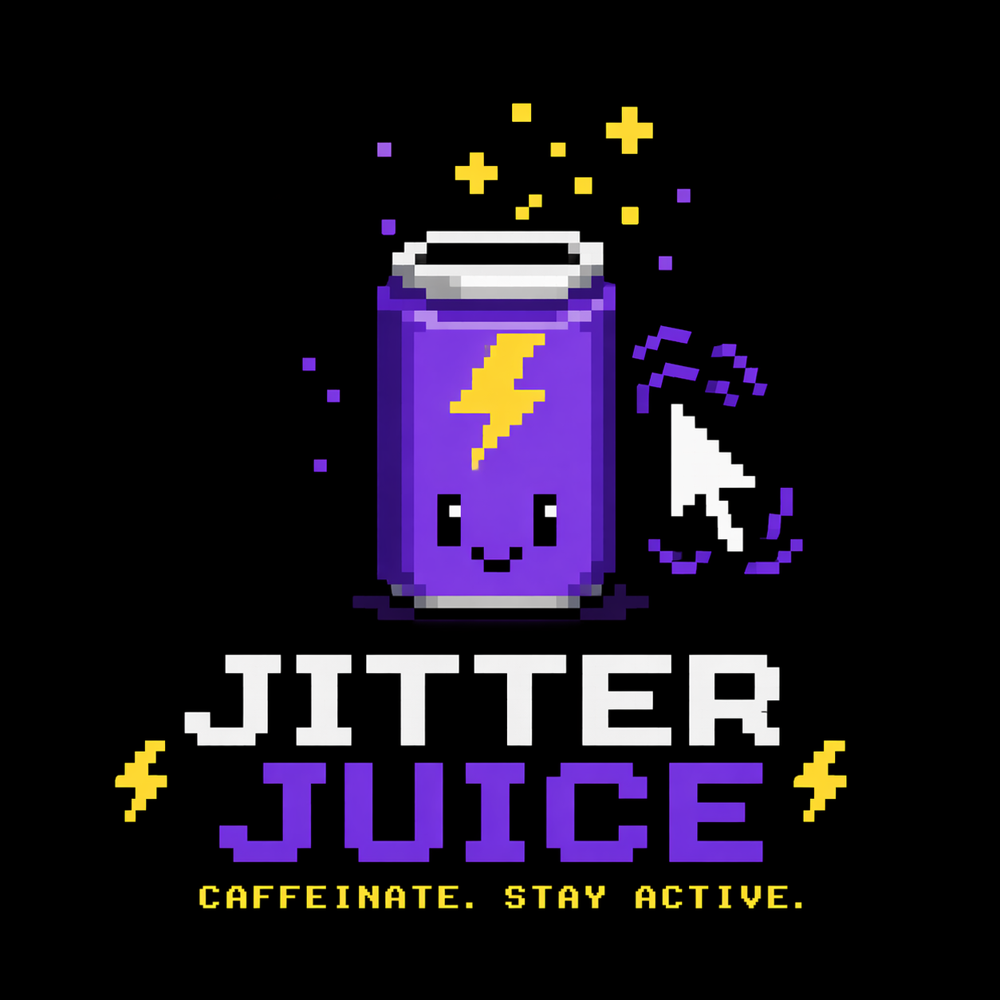

**Jerry** is the smug little can in the art—mascot, attitude, entire brand.

macOS menu bar app: **nudge the cursor on a timer** and optionally **keep the display awake**, without living in Terminal.

*What it’s “for”:* That status indicator that claims to know if you’re “there”? Not our department. Definitely not for convincing certain chat apps you’re glued to your desk while you make toast. Professionals, all of us.

### Main menu

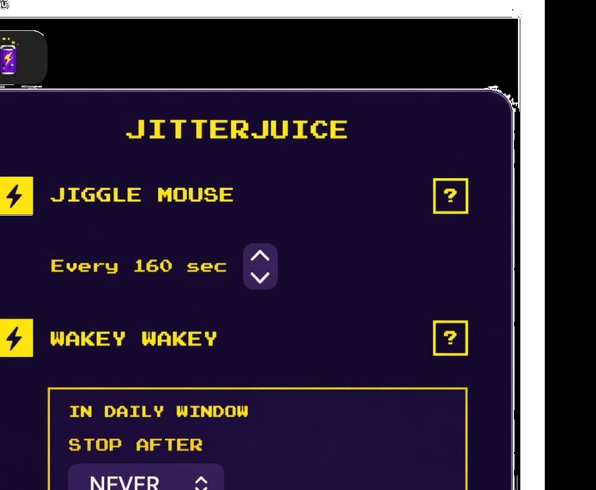

- **Jiggle Mouse** nudges the cursor on an interval you choose. That tiny movement is often enough to keep chat and other apps from treating you as “away” or idle when you’re still at the desk—without babysitting the window.
- **Wakey Wakey** asks macOS to keep the **display** from sleeping (a “caffeinated” display), with optional auto-stop and a daily time window. It’s separate from Jiggle Mouse; use either or both.

Open **Settings** (gear) for idle-only jiggle, nudge distance, menu bar icon style, and the full list of themes.

### Themes (Settings → Appearance)

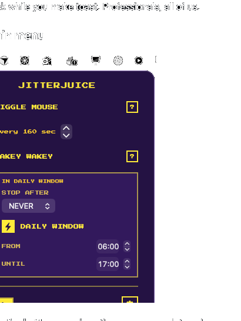

**Juice** themes reskin the retro menu and menu bar art so you can match your vibe—classic Jitter purple, Dracula, Moon, Deadly, Apple system style, Donny, Treehugger, Pride, Hail Storm (pixel rain), Blade Runner (neon cyberpunk), or your own colors under **Custom Juice**.

---

## Download

| Version | macOS |
|--------:|--------|
| **1.1** | [**Latest release** (`.dmg`)](https://github.com/tannerwuster/JitterJuice/releases/latest) |

Download the **`.dmg`** from the release, **double-click** to mount it, then drag **JitterJuice.app** into **Applications** (the disk image has a shortcut there). Eject when finished. If there’s nothing to download yet, attach a **`.dmg`** on [Releases](https://github.com/tannerwuster/JitterJuice/releases) first.

### macOS won’t let Jerry in (Gatekeeper tantrums)

Apple’s bouncer doesn’t recognize this build—it’s not **notarized**, so your Mac may flash a dramatic **“could not verify…”** dialog with all the warmth of a tax audit. Jerry’s harmless; the paperwork just isn’t filed.

Try, in order:

1. **System Settings → Privacy & Security** — scroll until you see a note that **JitterJuice** was blocked, then smash **Open Anyway** (it’s shy; it only shows up after you’ve tried to open the app once and been rejected, like a nightclub with emotional baggage).
2. **Right-click (or Control-click) `JitterJuice.app` → Open** — sometimes this reveals an **Open** button that double-clicking cruelly withholds.
3. **Terminal, if you trust what you downloaded** (e.g. you built it or read the source): strip the quarantine sticker and try again:
   ```bash
   xattr -cr /Applications/JitterJuice.app
   ```
   If the app lives somewhere else, point at that path instead. Don’t run this on random binaries from strangers—only on Jerry when you’re sure he’s *your* Jerry.

The *fancy* fix for everyone else is **Developer ID signing + notarization** (paid Apple Developer account). Until then, welcome to the club of indie apps that macOS side-eyes for sport.

<details>
<summary><strong>Maintainers: ship a release</strong></summary>

1. **Xcode:** Product → Archive → Distribute App → **Copy App** (or export **`JitterJuice.app`** from a **Release** build).
2. **DMG:** Put **`JitterJuice.app`** in a folder, add `ln -s /Applications Applications`, then run  
   `hdiutil create -volname "JitterJuice" -srcfolder <that-folder> -ov -format UDZO -fs HFS+ JitterJuice-1.1.dmg`  
   (bump the filename when the version changes).
3. Upload the **`.dmg`** on GitHub **Releases** with tag **`v1.1.0`** (or match the version in the table above).
4. Update this README’s version in the title and table when you cut a new release.

</details>

---

## Build from source

Repo: [github.com/tannerwuster/JitterJuice](https://github.com/tannerwuster/JitterJuice)

```bash
git clone https://github.com/tannerwuster/JitterJuice.git
cd JitterJuice
# SSH: git@github.com:tannerwuster/JitterJuice.git
```

Open **`JitterJuice.xcodeproj`** in Xcode (scheme **JitterJuice**), or:

```bash
xcodebuild -project JitterJuice.xcodeproj -scheme JitterJuice -configuration Debug -derivedDataPath "$(pwd)/.derivedData" build
open .derivedData/Build/Products/Debug/JitterJuice.app
```

## Permissions

**Accessibility** (mouse nudges): **System Settings → Privacy & Security → Accessibility** → enable JitterJuice.

## Assets

Bundled images live in **`JitterJuice/Assets.xcassets`** (e.g. `MenuBarIcons/`). **Master exports** for menu bar art (edit here, then copy into the matching `.imageset` when updating the app) are in **`Artwork/MenuBar/`**:

| Icon | File | Role |
|:----:|------|------|
| 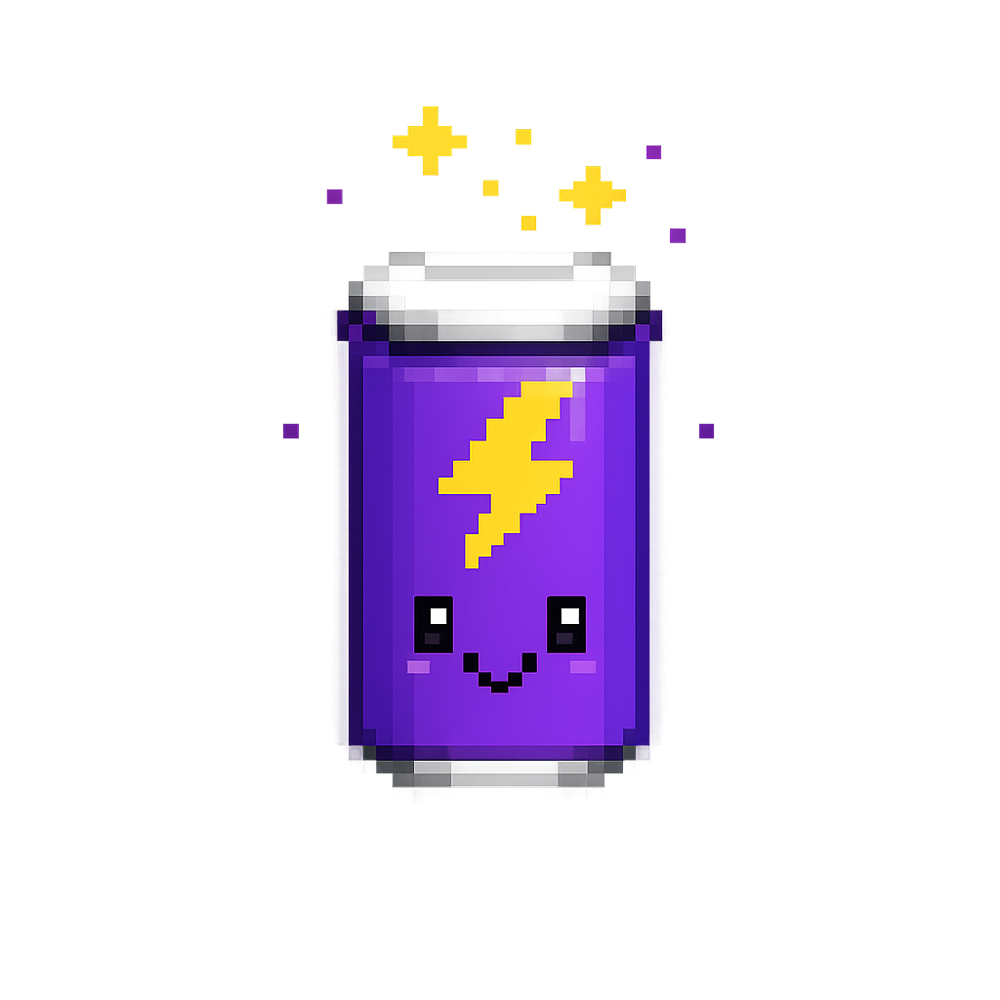 | `Artwork/MenuBar/jitterjuicemenuicon.png` | Default can → `JitterJuiceMenuBar.imageset` |
| 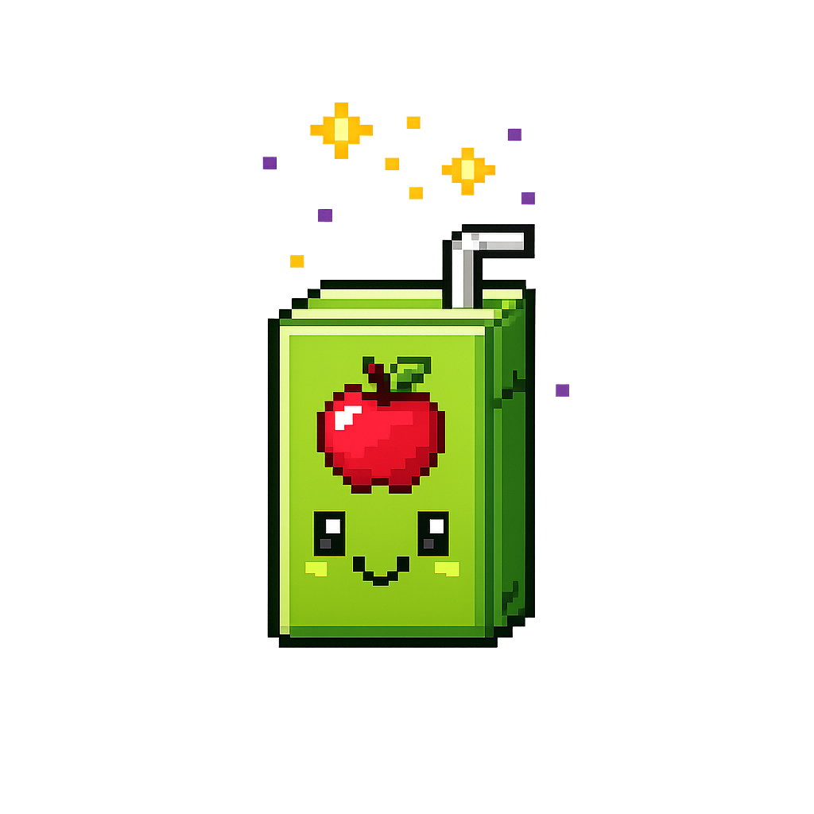 | `Artwork/MenuBar/applejuiceicon.png` | Apple Juice → `applejuiceicon.imageset` |
| 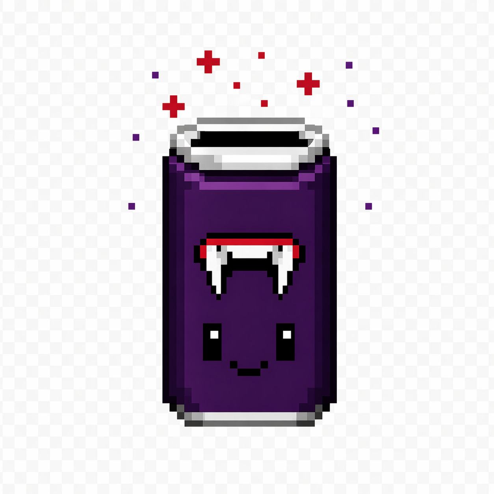 | `Artwork/MenuBar/draculaicon.png` | Dracula Juice → `draculaicon.imageset` |
|  | `Artwork/MenuBar/deadlyjuice.png` | Deadly Juice → `deadlyjuice.imageset` |
| 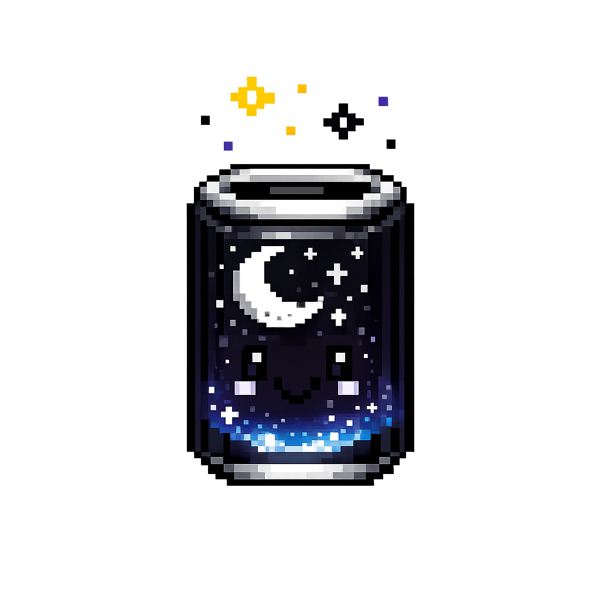 | `Artwork/MenuBar/moonjuiceicon.png` | Moon Juice → `moonjuiceicon.imageset` |
| 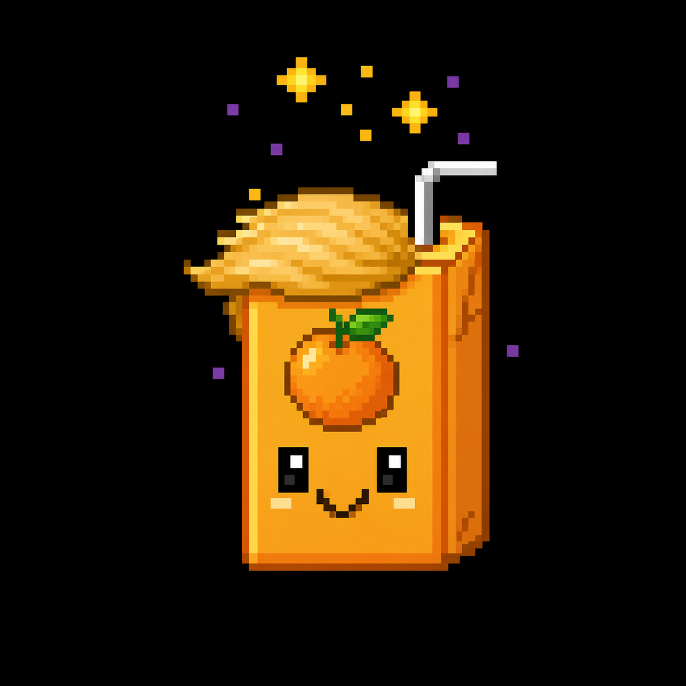 | `Artwork/MenuBar/orangejuiceicon.png` | Donny Juice → `donnyjuiceicon.imageset` |
| 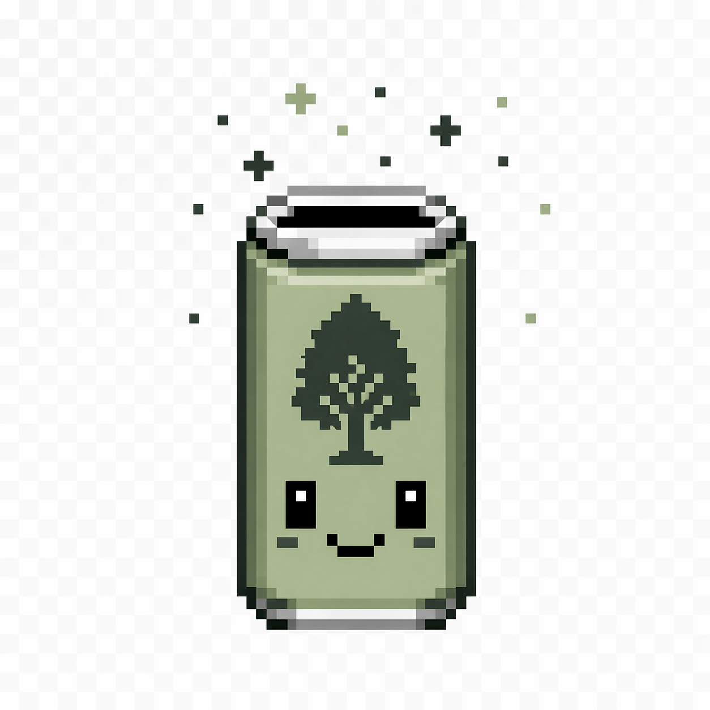 | `Artwork/MenuBar/treehuggerjuiceicon.png` | Treehugger Juice → `treehuggerjuiceicon.imageset` |
| 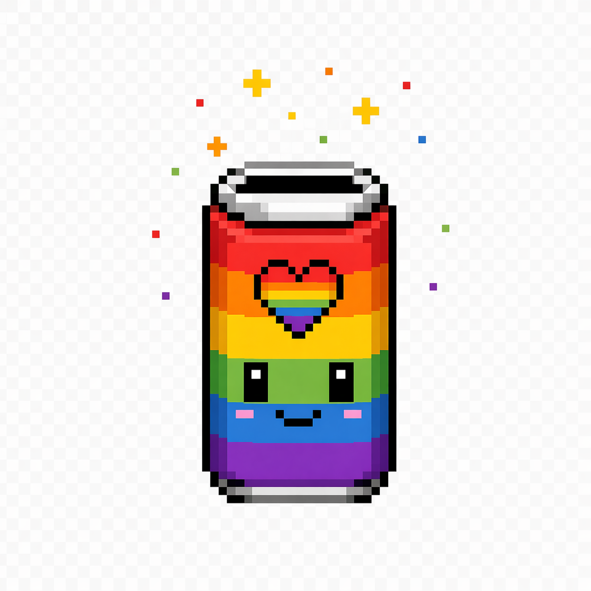 | `Artwork/MenuBar/pridejuiceicon.png` | Pride Juice → `pridejuiceicon.imageset` |
| 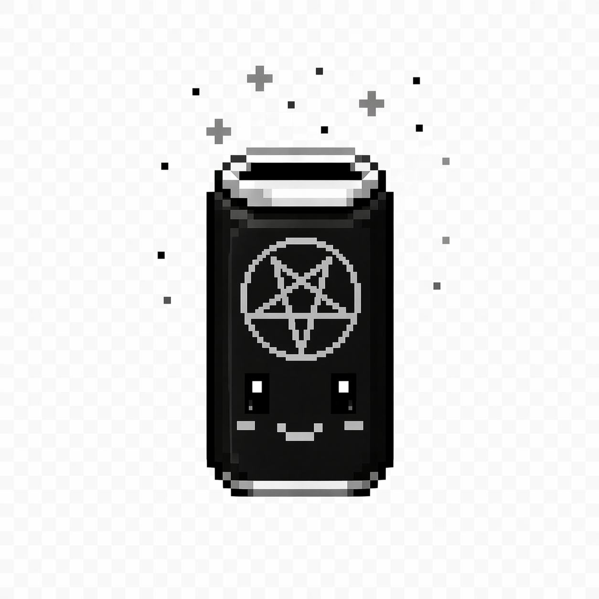 | `Artwork/MenuBar/hailstormjuiceicon.png` | Hail Storm Juice → `hailstormjuiceicon.imageset` |
| 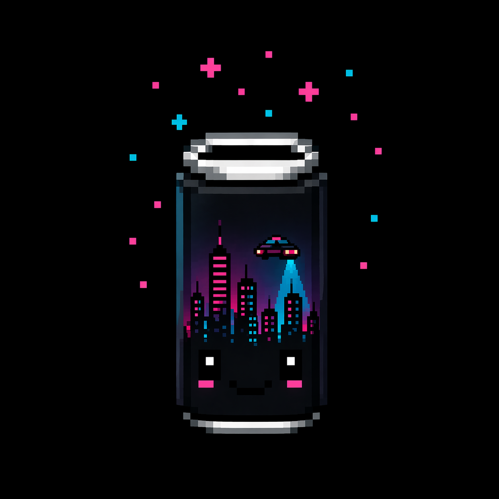 | `Artwork/MenuBar/bladerunnericon.png` | Blade Runner Juice → `bladerunnericon.imageset` |
| 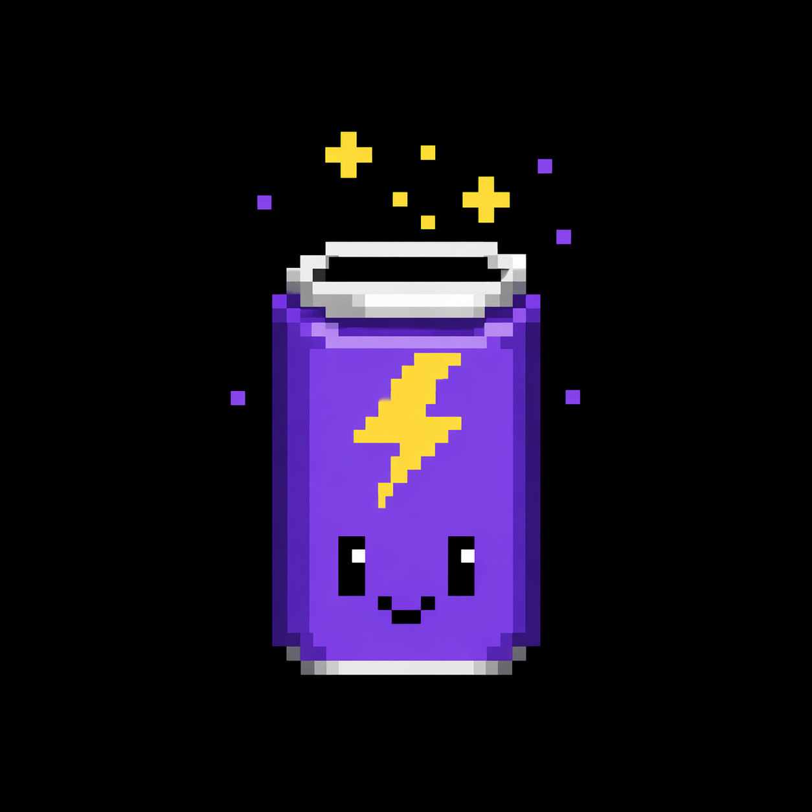 | `Artwork/MenuBar/jitterjuiceicon.png` | App icon source → `AppIcon.appiconset` |
|  | `Artwork/MenuBar/jitterjuicelogo.png` | Marketing / README |
|  | `Artwork/README/readme-main-menu.png` | README screenshot (main menu, full frame, transparent mat) |
|  | `Artwork/README/readme-settings-appearance.png` | README screenshot (settings & themes, full frame, transparent mat) |
